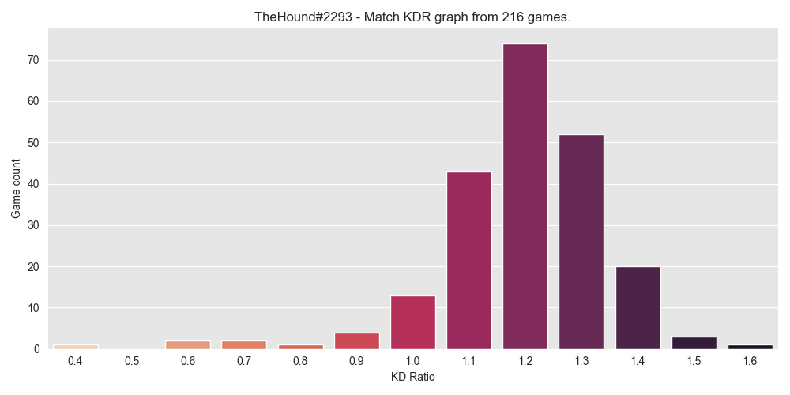

### Warzone KDR lobby scraper

Python script that can plot lobby KDRs of someones last N lobbies.

If you wonder why some people seem to have very easy lobbies, you can easily compare them with yours! You might find that some people abuse the game to match with weaker players to feel good.

About program:
- **To use** you need to fill in your browser headers at [line 21](https://github.com/HoundThe/WarzoneLobbyScraper/blob/main/warzone_scraper.py#L21) and the rest if pretty straightforward.
- There is delay between requests 2 seconds by default, you can lower it, but be careful about ratelimits if you are trying to plot large amount of lobbies.
- Some people might not have enough games played or data on codtracker.
- Plots have fixed ticks from 0.4 to 1.6 KDR, which works for pretty much everyone except some outliers.
- All calculated match KDRs are cached into the disk with Pickle, so you don't have to spam API for the same match twice if you want to replot.
- I've made the calculation the same as COD trackers as match team KDR

The headers can look like this, can be exported from browser as cURL commands and converted to Python code using https://curl.trillworks.com/:
```
        self.headers = {
            'authority': 'api.tracker.gg',
            'sec-ch-ua': '" Not A;Brand";v="99", "Chromium";v="90", "Google Chrome";v="90"',
            'accept': 'application/json, text/plain, */*',
            'accept-language': 'en',
            'sec-ch-ua-mobile': '?0',
            'user-agent': 'Mozilla/5.0 (Windows NT 10.0; Win64; x64) AppleWebKit/537.36 (KHTML, like Gecko) Chrome/90.0.4430.93 Safari/537.36',
            'origin': 'https://cod.tracker.gg',
            'sec-fetch-site': 'same-site',
            'sec-fetch-mode': 'cors',
            'sec-fetch-dest': 'empty',
            'referer': 'https://cod.tracker.gg/',
            'cookie': 'X-Mapping-Server=s13; _ga=GA1.2.1448582809.1617622930; __cfduid=d1944447010737f1d68c08e07b8ca3f751619684886; __cflb=02DiuFQAkRrzD1P1mdjW28WYn2UPf2uF9TyLXPf6LtKtg',
        }
```



Data source: https://cod.tracker.gg/warzone/
